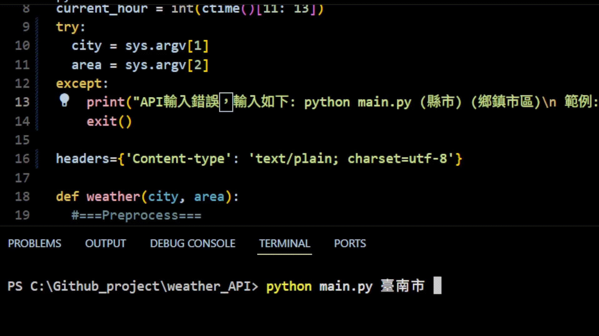

## Background
  I'm working for my friend, Recently looking for weather API can access any location in Taiwan, Since other API request to pay.

  English version not yet considered.

## How to use
  In Terminal input:
  >python main.py city area

  eg: python main.py 台南市 東區

  And generate JSON in currently directory.

  Here is demo:
  